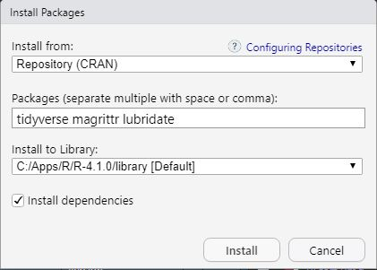

# Preparation {#preparation}
The material for this course uses R through RStudio. R is a software environment for performing statistical analyses. RStudio is a helper program that makes it easier to use R. I assume that you are familiar with both R and RStudio from the prerequisite courses. This module will explain how to install R, RStudio, and helper packages, and how to configure and use RStudio in an efficient manner for the course.

::: {.tip data-latex=""}
R is like the engine of a car and RStudio is like the dashboard.^[This analogy is from [Modern Dive](https://moderndive.github.io/moderndive_labs/static/previous_versions/v0.4.0/2-getting-started.html)]
:::

&nbsp;

## Installing R and RStudio
R and RStudio can be installed to your personal computer, but does not work well if you have a ChromeBook or if your machine is old (especially Macs). If you have a ChromeBook or old machine then please see me for potential alternatives

### Windows
To install R on a Windows machine, download the installer from [this site](https://cloud.r-project.org/bin/windows/base/) by selecting the “Download R X.X.X for Windows” link at the top.^[The X's will be replaced with version numbers; e.g., 4.1.2.] Locate the installer on your computer and run it. Using all of the default choices will perform an acceptable install for this course.


To install RStudio on a Windows machine, download the installer from [this link](https://rstudio.com/products/rstudio/download/#download) by selecting the “DOWNLOAD RSTUDIO FOR WINDOWS” button. Locate the installer on your computer and run it. Using all of the default choices will perform an acceptable install for this course.

### Mac
To install R on a Mac, download the installer from [this site](https://cloud.r-project.org/bin/macosx/) by selecting one of the “R-X.X.X.pkg” links appropriate for your operating system under the “Latest Release” section.^[The X's will be replaced with version numbers; e.g., 4.1.2.] Locate the “.pkg” file on your computer and install it per usual. Using all of the default choices will perform an acceptable install for this course.

To install RStudio on a Mac, download the installer from [this link](https://rstudio.com/products/rstudio/download/#download) by selecting the “DOWNLOAD RSTUDIO FOR MACOS” button (you can also select the MacOS option under the “All Installers” section). Locate the “.dmg” file on your computer and install it per usual. Using all of the default choices will perform an acceptable install for this course.

&nbsp;

## Optimally Configuring RStudio
I suggest changing the following default settings in RStudio for optimal efficiency.

* In RStudio select the "Tools" menu and "Global Options" submenu.
  * Under the "Workspace" heading (assuming that "General" on the left is selected) ...
    * Turn off (unselect) the "Restore .RData into workspace at startup" item.
    * Change "Ask" following "Save Workspace to .RData on exit:" to "Never".
  * Select "Code" on the left and "Display" at the top ...
    * Turn on (select) "Highlight selected line".
    * Turn on (select) "Show margin" (and I usually put 80 as the "Margin column").
    * Turn on (select) "Rainbow Parentheses".
  * Select "Console" on the left ...
    * Turn on (select) "Show syntax highlighting in console input.
  * Press "OK".

I also suggest reorganizing the panes in RStudio with the "Tools" menu and "Global Options" submenu (as above). Then select "Pane Layout" on the left and change the options to look like that below.

```{r echo=FALSE, out.width='65%'}
knitr::include_graphics("zimgs/RStudio_PaneLayout.JPG")
```

&nbsp;

With this arrangement, I usually have my scripting window (upper-left) fill the entire left side of RStudio and the console window (upper-right) fill the entire right side of RStudio. I will usually only open up the two lower panes when I need the tabs within them (and at times they will open on their own).

Finally, I prefer to have lighter text on a darker background (as you can see with my RStudio screen captures). You can try different RStudio editor themes by again selecting the "Tools" menu and "Global Options" submenu and then selecting the "Appearance" item on the left. My personal preference is to select "Tomorrow Night 80s" under the "Editor Theme" list. This is just personal preference, I have seen students use other themes that match their eye better.

&nbsp;

## Install Tidyverse and Other Packages
Methods in this course depend on functions from the `tidyverse`, `magrittr`, and `lubridate` packages. The following steps in RStudio will install these packages.^[These same steps can be used to install other packages as needed.]

1. Open the "Packages" tab (in the lower-left pane if your RStudio panes are rearranged to match my preferences).
1. Press the "Install" button on the toolbar.
1. Enter the names of the three packages in the "Packages ..." box.

```{r echo=FALSE, out.width='50%'}

```

4. Press the "Install" button.
1. Check to see if the installations worked by typing the codes below into the console (upper-right pane if you rearranged the panes) to see if you get the results shown below (*version numbers may be different but they should be at or greater than those shown below*).

```{r message=TRUE}
library(tidyverse)
library(magrittr)
library(lubridate)
```

&nbsp;

## RStudio Projects
Projects in RStudio can be used to keep all parts of a data analysis organized into one folder. The project also keeps track of specific information about the project that helps keep your analyses organized. It is generally best to use a separate project for each data analysis project. For this course it is adequate to use one project for all of your work. 

### Creating a Project
A project can be created in RStudio with these steps.

1. Select the "File" menu, "New Project" submenu, "New Directory" item, and "New Project" item (use "Existing Directory" item if you have already created a folder outside of RStudio),
1. Enter the name for the directory and the project under "Directory Name",

```{r echo=FALSE, out.width='60%'}

```

3. Browse to an appropriate place for this new folder as shown above under "Create Project as Subdirectory of", and
1. Select "Create Project".

This will refresh RStudio (i.e., like starting anew) but you will see the name of your project above the upper-right corner of the upper-right pane in RStudio.

```{r echo=FALSE, out.width='60%'}
knitr::include_graphics("zimgs/RStudio_Project_ShowName.JPG")
```

For consistency with many of the examples in subsequent modules, you should create a "data" directory/folder within your project folder. Then put all data files in this folder, whereas all code scripts will be in the main project folder.

### Opening an Existing Project
An existing project can be opened with the "File" menu and "Open Project" submenu, browsing to the folder where the project exists, and then selecting the .Rproj file in that folder. Alternatively, open a project (or create a new project) by selecting the small "down arrow" next to the project name on the toolbar and then selecting "Open Project" near the top of the box that appears or selecting a recently opened project from the list further down.

```{r echo=FALSE, out.width='30%'}
knitr::include_graphics("zimgs/RStudio_Project_OpenProjectList.JPG")
```

Open the project in a new RStudio window by selecting the small icon to the right of an existing project name or using "Open Project in New Session ...".

::: {.tip data-latex=""}
* RStudio opens the project you were last working in when it starts.
* Look on the right side of the RStudio toolbar to see which project you are currently working in.
:::

### Project Benefits
The major benefit of using an RStudio Project is that the working directory is automatically set to the project folder. Thus, you avoid all of the hassles of using `setwd()`{.inline}. In addition, you can send your script and data file to someone (like me) who can then open in a project and have it work without needing to modify the working directory structure.

::: {.tip data-latex=""}
You do not need to use `setwd()`{.inline} with RStudio projects!!
:::

&nbsp;

## Using the Notebook Template
Notebooks in RStudio are an efficient way to enter R code, show results of R code, write answers to assignment questions, and compile all of that to a document that can be handed in.

For class assignments, start by downloading [this template](https://raw.githubusercontent.com/droglenc/NCWrangling/main/resources/TEMPLATE.Rmd) (right-click, don't change the name) to your project folder. Then open the template in RStudio and change the Author in line 5 to your name. Save the template with this change.

Every time you start an assignment open the template file in RStudio and immediately save it (File .. Save As) with a different name (e.g., "Assignment1" ... make sure that the name does not have a "dot" in it). Then edit the Title in line 4 to something that represents the assignment (e.g., "Wrangling Columns"). Do not change anything else in the first 22 lines.

```{r echo=FALSE, out.width='90%'}

```

&nbsp;

### Including Text in the Notebook
#### Creating Sections {-}
Most assignments will have several questions separated into sections. Your answers to the questions should be shown under section headings with the same name as on the assignment. Section headings are created in an R Notebook by preceding the section heading name with a single hashtag. The template has one section heading started that looks like this ...

```
# EDIT THIS WITH FIRST SECTION HEADING TEXT
```

You should change this text to create an appropriate section heading; e.g., 

```
# Arctic Penguins
```

::: {.tip data-latex=""}
Subsequent section headings can be inserted by preceding text with a single hashtag, making sure that there is a blank line prior to the section heading line.
:::

#### Writing Text for Your Answers {-}
Sentences can be included by typing the text at the beginning of any line. A new paragraph is created by pressing return twice so that there is a blank line between paragraphs.

#### Numbered Lists for Your Answers {-}
A numbered list is created by starting a line with "1. " followed by text. If there are no blank lines between consecutive "1. " items then RStudio will automatically iterate the number when the document is compiled.^[Note the space after the dot and before the text that will form the list item.] For example, typing this ...

```{r echo=FALSE, out.width='40%'}

```

... produces this text ...


```{r echo=FALSE, out.width='40%'}
knitr::include_graphics("zimgs/Notebook_OrderedList_Out1.JPG")
```

However, if the items in the ordered list are separated by, for example, an R chunk of code then you will need to manually restart the list numbering. For example, typing this ...

```{r echo=FALSE, out.width='60%'}

```

... produces this text ...


```{r echo=FALSE, out.width='60%'}

```

&nbsp;

### Compile Notebook to HTML Document
Once you are comfortable that your R code runs without error and that you have answered all questions for the assignment, then compile your Notebook to an HTML document by pressing the "Knit" button on the console window toolbar. Make sure to check your document for completeness and neatness before turning in.

```{r echo=FALSE, out.width='40%'}
knitr::include_graphics("zimgs/Notebook_Knit.JPG")
```

If the document does not produce an HTML document (this make take several seconds) then there may be an error in your R code.


```{r echo=FALSE}
## These are loaded here to avoid conflicts above and because they are not
## needed until later modules.
library(kableExtra)
library(ggpmisc)
```

