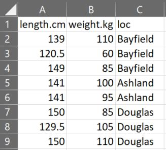
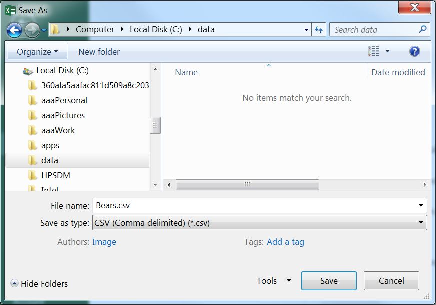
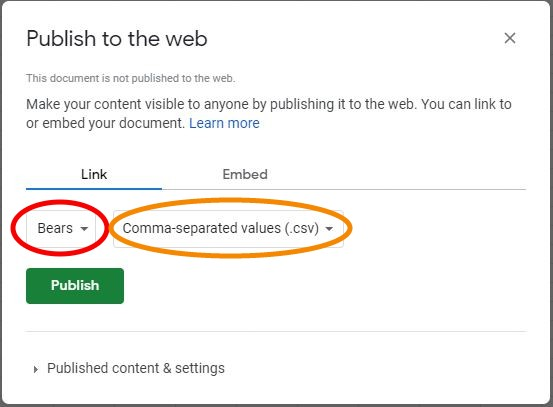
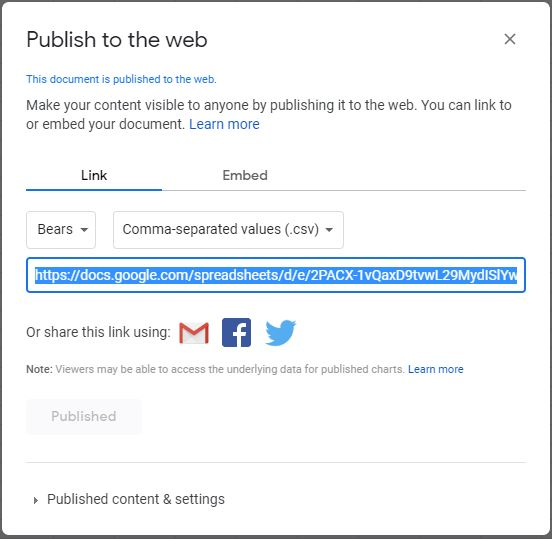

# Read External Data Files
Most realistic data has more than a few individuals and is, thus, not easily entered using `data.frame()`{.inline} or `tibble()`{.inline} as shown in Section \@ref(data-frames). Rather these data are often entered and stored in a spreadsheet or database that is external to R and must then be read into R. This module describes how data should be entered into a spreadsheet and then how that data is read into R.

## Entering Data
Tidy data (see Section \@ref(tidy-data)) is often entered into a spreadsheet program such as Microsoft Excel or Google Sheets. The spreadsheet should be organized with variables in columns and individuals in rows, with the exception that **the first row should contain variable names.** The example spreadsheet below shows the length (cm), weight (kg), and capture location data for a small sample of Black Bears.

```{r echo=FALSE, out.width='30%'}

```

&nbsp;

**Variable names should NOT contain spaces.** For example, don't use "total length" or "length (cm)". If you feel the need to have longer variable names, then separate the parts with a period (e.g., "length.cm") or an underscore (e.g., "length_cm"). **Variable names can NOT start with numbers or contain "special" characters** such as "~", "!", "&", "@", etc. Furthermore, numerical measurements should NOT include units (e.g., don't use "7 cm"). Finally, for categorical data, make sure that all categories are consistent (e.g., do not use both "bayfield" and "Bayfield").

When entering data make sure to follow the three rules of tidy data (see Section \@ref(tidy-data)). For example, the following data are methyl mercury levels recorded in mussels captured from "impacted" and "reference" locations.

```
  impacted   0.011  0.054  0.056  0.095  0.051  0.077
  reference  0.031  0.040  0.029  0.066  0.018  0.042  0.044
```

As described in Section \@ref(tidy-data), one "observation" (i.e., row) is a methyl mercury measurement on a mussel AND which group the mussel belongs. The rules for tidy data dictate two columns (one for each of the two variables recorded) and 13 rows (one for each observation of a mussel). Thus, these data would be entered into the spreadsheet as below.

```{r echo=FALSE, out.width='20%'}
knitr::include_graphics("zimgs/StackedData.jpg")
```

&nbsp;

## Saving the External File
The spreadsheet may be saved in the format of the spreadsheet program (e.g., as an Excel file) to be read into R.

It is also common to save the file as a *comma separated values* (CSV) file to be read into R. The advantage of a CSV file is that these files are small and, because they do not require any special software (e.g., Excel) to read, they are very likely to always be able to be read into R. The next two sections describe how to create CSV files in Excel and GoogleSheets.

### Excel
An Excel worksheet is saved as a CSV file by selecting the *File* menu and *Save As* submenu, which will produce the dialog box below. In this dialog box, change "Save as type" to "CSV (Comma delimited)",^[There are several choices for CSV files here; do NOT choose the one with "UTF-8" in the name.], provide a file name (**do not put any periods in the name**), select a location to save the file (**this should be in your RStudio project folder**), and press "Save." Two "warning" dialog boxes may then appear -- select "OK" for the first and "YES" for the second. You can now close the spreadsheet file.^[You may be asked to save changes -- you should say "No."]

```{r echo=FALSE, out.width='60%'}

```

### Google Sheets
A Google Sheet can be made available as a CSV file by selecting the *File* menu, *Share* submenu, and *Publish to web* submenu. In the ensuing dialog box, change “Entire Document” to the name of the sheet you want to publish and “Web Page” to “Comma-separated values (.csv)” under the "Link" tab.

```{r echo=FALSE, out.width='50%'}

```

Then press the "Publish" button and press OK when asked to confirm publishing.

```{r echo=FALSE, out.width='50%'}

```

Finally, select and copy (CTRL-C or CMD-C) the entire link shown in the box above. This link will be used as described in the next section.


## Reading an External File
### CSV Files
CSV files may be read into R with `read.csv()`{.inline} from base R or `read_csv()`{.inline} from `tidyverse`. For most of our applications there will be little functional difference between these two functions. However, `read_csv()`{.inline} is faster than `read.csv()`{.inline} and can be a little "smarter" about the way it imports certain columns.^[How `read_csv()`{.inline} identifies the class of data in a column is described [here](https://r4ds.had.co.nz/data-import.html#parsing-a-file)] In addition, it is a bit more transparent about what it is doing. For those reasons, `read_csv()`{.inline} will be used in this course.

::: {.tip data-latex=""}
An object saved from `read_csv()`{.inline} will be a tibble.
:::

The first argument to `read_csv()`{.inline} is the filename, which may include a partial path relative to your working directory, a full path to the file, or be a valid URL. For example, the code below reads ["Bears.csv"](https://raw.githubusercontent.com/droglenc/BookWrangling/main/data/Bears.csv) from the "data" folder in my working directory^[If using an RStudio project then the working directory will be the project's directory.] and stores the result in the `bears` object. Here, I used `file.path()`{.inline} to combine the folder names in the partial path with the filename because `file.path()`{.inline} creates a path that will be correct for your operating system.^[Windows and Mac OS handle paths differently; this function avoids that complication.]

```{r}
bears <- read_csv(file.path("data","Bears.csv"))
bears
```

The filename argument could also be the link to the published Google Sheet (from above).

```{r}
bears <- read_csv("https://docs.google.com/spreadsheets/d/e/2PACX-1vQaxD9tvwL29MydISlYw4bVXrw6-rvkEbT_2qFGxw7HuYX6M3h83aIYT4eZ-mrrEfJf8y5Q8p1Rkn4Z/pub?gid=522647677&single=true&output=csv")
bears
```

The URL can be any valid URL and does not have to be just from a published Google Sheet. For example, the following code reads a CSV from [this page](https://sports-statistics.com/sports-data/nba-basketball-datasets-csv-files/) that lists information about every player who has played in the National Basketball Association (NBA).

```{r cache=TRUE}
players <- read_csv("https://sports-statistics.com/database/basketball-data/nba/NBA-playerlist.csv")
players
```

&nbsp;

The `read_csv()`{.inline} function provides a variety of options that will help you correctly load CSV files that may be "quirky" in some respects. Use `skip.lines=`{.inline} to skip, for example, the first two lines in a [CSV file](https://raw.githubusercontent.com/droglenc/BookWrangling/main/data/Bears_SkipLines.csv) that do not contain data (perhaps they hold comments).

```{r}
tmp <- read_csv(file.path("data","Bears_SkipLines.csv"),skip=2)
tmp
```

Alternatively, use `comment=`{.inline} to identify leading characters that identify lines in the [data file](https://raw.githubusercontent.com/droglenc/BookWrangling/main/data/Bears_Comment.csv) that are comments and should not be read as data.

```{r}
tmp <- read_csv(file.path("data","Bears_Comment.csv"),comment="#")
tmp
```

Often data may be missing. By default, R treats `NA` in the data frame as missing data. If all missing data is coded with `NA` then `read_csv()`{.inline} will handle this properly. For example, note the `NA`s in the second and eighth rows below after reading [this data file](https://raw.githubusercontent.com/droglenc/BookWrangling/main/data/Bears_Missing1.csv).

```{r}
tmp <- read_csv(file.path("data","Bears_Missing1.csv"))
tmp
```

However, some researchers may denote missing data with other codes. For example, the [data file](https://raw.githubusercontent.com/droglenc/BookWrangling/main/data/Bears_Missing2.csv) read below used "-" to denote missing data. In cases like this, use `na=`{.inline} to dictate which codes should be "missing" and converted to `NA` in the data frame object.

```{r}
tmp <- read_csv(file.path("data","Bears_Missing2.csv"),na="-")
tmp
```

In other instances, the research may have sloppily used multiple codes for missing data. In these instances (as with [this file](https://raw.githubusercontent.com/droglenc/BookWrangling/main/data/Bears_Missing3.csv)), set `na=`{.inline} to a vector of all codes to be converted to `NA` in the data frame object.

```{r}
tmp <- read_csv(file.path("data","Bears_Missing3.csv"),na=c("NA","NAN","-"))
tmp
```

&nbsp;

The examples above will serve you well for most files read in this class, with the possible exception of files that contain variables with dates. Handling dates is discussed in Module \@ref(dates-and-times).

### Excel Files
Some researchers prefer to save data entered in Excel as an Excel workbook rather than a CSV file. The main argument here is that saving to a CSV often results in two files -- an Excel workbook file and a CSV file. It is generally bad practice to have your data in two files as you may update the Excel file and forget to save it to the CSV file or you may update the CSV file and forget to also update the Excel file. Regardless of the reason, data can generally be read from an Excel file into R.

The `read_excel()`{.inline} function from the `readxl` package provides a coherent process for reading data from an Excel workbook. The first argument to `read_excel()`{.inline} is the name of the Excel file, possibly with path information. By default `read_excel()`{.inline} reads the first sheet in the Excel workbook. The example below reads the first sheet of the ["DataExamples.xlsx" workbook](https://raw.githubusercontent.com/droglenc/BookWrangling/main/data/DataExamples.xlsx) in the "data" folder.^[I use the `readxl::read_excel()`{.inline} construct here rather than loading the `readxl` package and then simply using `read_excel()`{.inline} because this is the only function that I will use from `readxl`. Thus, I am not loading unneeded functions into my work environment.]

```{r}
tmp <- readxl::read_excel(file.path("data","DataExamples.xlsx"))
tmp
```

Data on specific sheets can be read by including the sheet name in `sheet=`{.inline}. Additionally, lines at the top of the sheet can be skipped with `skip=`{.inline} as described for `read_csv()`{.inline}. For example, the code below reads the data after the first two lines in the "Bears_SkipLines" worksheet in the same Excel workbook.

```{r}
tmp <- readxl::read_excel(file.path("data","DataExamples.xlsx"),
                          sheet="Bears_SkipLines",skip=2)
tmp
```

Missing data is handled exactly as described for `read_csv()`{.inline}.

```{r}
tmp <- readxl::read_excel(file.path("data","DataExamples.xlsx"),
                          sheet="Bears_Missing3",na=c("NA","NAN","-"))
tmp
```

&nbsp;

In general, `read_excel()`{.inline} works best if the data are arranged in a rectangle starting in cell "A1." However, `read_excel()`{.inline} can handle different organizations of data in the worksheet as described [here](https://readxl.tidyverse.org/articles/sheet-geometry.html). Researchers may also use multiple header rows in their Excel worksheet; e.g., variables names in the first row, variable units in the second row. [This](https://readxl.tidyverse.org/articles/articles/multiple-header-rows.html) provides a strategy for reading data arranged in such a way.

### Google Sheets
It is also possible to read a file directly from Google Sheets using functions in the `googlesheets4` package as described [here](https://googlesheets4.tidyverse.org/articles/articles/read-sheets.html). Using this package to read directly from Google Sheets requires you to authorize R to access your Google Sheets.

### Other Formats
Data may be stored in other, less common formats. A few examples of functions to read these other formats are listed below.

* `read_csv2()`{.inline} (from `tidyverse`) for fields separated by semi-colons (rather than commas) as is common in Europe.
* `read_tsv()`{.inline} (from `tidyverse`) for fields separated by tabs (rather than commas). An example is in Section \@ref(dt-stream-discharge).
* `read_fwf()`{.inline} (from `tidyverse`) for fields that are a fixed width.
* `read_sav()`{.inline} (from `haven`) for ".sav" files from SPSS.
* `read_sas()`{.inline} (from `haven`) for ".sas7bdat" and ".sas7bcat" files from SAS.
* `read_dta()`{.inline} (from `haven`) for ".dta" files from Stata.
