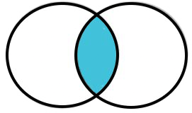
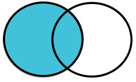
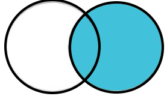
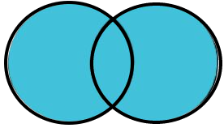

# Relational Data
## Nature of Relational Data
Some situations will have multiple data frames with related data. A particular analysis may require combining these data frames into a single data frame. If the data in the separate data frames are connected by a *key* variable then the data are said to be **relational** -- i.e., they relate to each other through a common variable (or variables).

As an example a college may have the following four data frames with respect to its students.

* Personal information (hometown, age, etc.)
* Financial aid information (family income, Pell Grant aid amount, etc.)
* Academic information (standing, major, gpa, etc.)
* Current course information (i.e., which courses a students is registered for)

Each of these data frames would also contain a student ID variable so that a student's personal information can be connect with the students financial aid, academic, or course information. This student ID variable is the key variable for these relational data frames.

Data from related data frames can be *join*ed in a variety of ways. This module will explain several types of joins and how to accomplish those joins in R.

::: {.defn data-latex=""}
**Relational Data**: Data tables that are connected by a common key variable.
:::

::: {.defn data-latex=""}
**Key Variable**: A variable in a data table that connects related data. This is often a unique "identification" variable.
:::

Relational data can be more efficient and, thus, lead to fewer data entry errors. For example consider a very simple set of data where the occurrence of plant species in plots is recorded, along with information about the plot. For example, the data for **one** plot that had five species may look like this ...

```{r echo=FALSE}
tmp1 <- tribble(
  ~plotID,~lat,~long,~loc,~species,
  101,43.4580,-91.2304,"Baffle Is.","Big Bluestem",
  101,43.4580,-91.2304,"Baffle Is.","Fox Sedge",
  101,43.4580,-91.2304,"Baffle Is.","Indian Grass",
  101,43.4580,-91.2304,"Baffle Is.","Prairie Dropseed",
  101,43.4580,-91.2304,"Baffle Is.","Tufted Hair Grass"
)
tmp1
```

However, with this data entry the four variables related to the plot (e.g., `plotID`, `lat`, `long`, and `loc`) must be repeated multiple times for each `species`. This repetition is both inefficient and error-prone. A better structure is to create one data frame, with `plotID`, with the characteristics for each plot ...

```{r echo=FALSE}
tmp1 %>% select(-species) %>% filter(!duplicated(.))
```

... and then a second data frame, again with `plotID`, with the species observed ...

```{r echo=FALSE}
tmp1 %>% select(plotID,species)
```

With this structure the only variable that is repeated is `plotID`, which will save time and reduce errors upon data entry.

::: {.tip data-latex=""}
If you find yourself repeat values when entering data, stop and determine if you can use a relational structure to be more efficient and reduce errors.
:::

## Join Concepts
```{r echo=FALSE}
x <- data.frame(id=c(101,102,102,103),val1=paste0("x",1:4))
y <- data.frame(id=c(101,102,104,104),val2=paste0("y",1:4),val3=paste0("z",1:4))

x2 <- rbind(x,c("",NA))
y2 <- rbind(y,c("",NA,NA))

all_combos <- full_join(mutate(x2,fake=1),mutate(y2,fake=1),by="fake") %>%
  select(-fake) %>%
  slice(-25)
```

To illustrate the various joins, suppose that a simple data frame `x` exists that has an `id` key variable and a `val1` measurement variable.^[The visualizations in this section are modified from https://twitter.com/hadleywickham/status/684407629259526148/photo/1.]

```{r echo=FALSE}
clrs <- FSA::col2rgbt(c('#a6611a','#dfc27d','#80cdc1','#018571','white'),0.7)
clrs.x <- clrs[c(1,2,2,3)]
knitr::kable(x,align="c") %>%
  kable_minimal(full_width=FALSE,html_font=khfont) %>%
  kable_styling(bootstrap_options=c("hover","condensed")) %>%
  row_spec(0,bold=TRUE) %>%
  column_spec(1,background=clrs.x,bold=TRUE)
```

Further suppose that a second data frame `y` has the same `id` key variable, though it may have different values, and different `val2` and `val3` measurement variables.^[In this treatment, the unique `id` values are also uniquely colored to help track individual observations in the descriptions below.]

```{r echo=FALSE}
clrs.y <- clrs[c(1,2,4,4)]
knitr::kable(y,align="c") %>%
  kable_minimal(full_width=FALSE,html_font=khfont) %>%
  kable_styling(bootstrap_options=c("hover","condensed")) %>%
  row_spec(0,bold=TRUE) %>%
  column_spec(1,background=clrs.y,bold=TRUE)
```

It is instructive when learning about joins to visualize all combinations of observations in the two data frames.^[Finding all combinations, however, is not needed to actually join two data frames.] As some key variable values may not be present in one of the data frames, combinations with a missing key variable value (and the measurement variables set to `NA`) must also be considered. All combinations of the rows in `x` and `y` with missing key variable values are shown on the left for each join type in the subsections below.

```{r echo=FALSE}
clrs.xA <- rep(c(clrs.x,"white"),each=5)[-25]
clrs.yA <- rep(c(clrs.y,"white"),times=5)[-25]
tbl_AC <- knitr::kable(all_combos,align="c") %>%
  kable_minimal(full_width=FALSE,html_font=khfont) %>%
  kable_styling(bootstrap_options=c("condensed")) %>%
  row_spec(0,bold=TRUE) %>%
  column_spec(1,background=clrs.xA,bold=TRUE) %>%
  column_spec(3,background=clrs.yA,bold=TRUE)
```

### Inner Join
An **inner join** is the simplest join. It returns values from both data frames where the key variable(s) match in both data frames. In our simple data frames an inner join returns the rows from all combinations of rows (see left below) where the `id` variables (i.e., colors) from `x` and `y` match (see center below). The final result is these rows with the duplicated `id` key variable removed (see right below).

```{r echo=FALSE}
ij_rows <- with(all_combos,which(id.x==id.y))  #rows to keep
ij_whiterows <- which(!(1:24 %in% ij_rows))    #rows to white out
tbl_AC_IJ <- tbl_AC %>%
  row_spec(ij_whiterows,background="white",color="white")

IJ <- inner_join(x,y,by="id")
tbl_IJ <- kable(IJ,align="c") %>%
  kable_minimal(full_width=FALSE,html_font=khfont) %>%
  kable_styling(bootstrap_options=c("hover","condensed")) %>%
  row_spec(0,bold=TRUE) %>%
  column_spec(1,background=clrs[c(1,2,2)],bold=TRUE)
  
tbl_AC %>%
  add_header_above(header=c("All combinations from x and y"=5)) %>%
  kable_styling(position="float_left")
tbl_AC_IJ %>%
  add_header_above(header=c("Retained for 'inner join'"=5)) %>%
  kable_styling(position="float_left")
tbl_IJ %>%
  add_header_above(header=c("Final 'inner join' result"=4)) %>%
  kable_styling(position="left")
```

<!-- for clearing the floats from above -->
<div style="clear:both;"></div>

::: {.defn data-latex=""}
**Inner Join**: Rows from both data frames where the key variable values match.

```{r echo=FALSE, out.width='20%'}

```
:::

### Left Join
A **left join** returns the same rows as an inner join (i.e., all rows where the key variables match) AND all rows from the first data frame that don't have a key variable match in the second data frame. The values for the variables in the second data frame for key values in the first data frame without a match are replaced with `NA`s. So, a left join will include rows for all key variables from the first data frame, but only rows from the second data frame that had a key variable match with the first data frame.

```{r echo=FALSE}
lj_rows <- with(all_combos,which(id.x==103 & id.y==""))
lj_rows <- c(ij_rows,lj_rows)                # all rows to keep (add inner joins)
lj_whiterows <- which(!(1:24 %in% lj_rows))    #rows to white out
clrs.xA2 <- clrs.xA
clrs.xA2[lj_whiterows] <- "white"
clrs.yA2 <- clrs.yA
clrs.yA2[lj_whiterows] <- "white"

tbl_AC_LJ <- knitr::kable(all_combos,align="c") %>%
  kable_minimal(full_width=FALSE,html_font=khfont) %>%
  kable_styling(bootstrap_options=c("hover","condensed")) %>%
  row_spec(0,bold=TRUE) %>%
  row_spec(lj_whiterows,background="white",color="white") %>%
  column_spec(1,background=clrs.xA2,bold=TRUE) %>%
  column_spec(3,background=clrs.yA2,bold=TRUE)

LJ <- left_join(x,y,by="id")
tbl_LJ <- kable(LJ,align="c") %>%
  kable_minimal(full_width=FALSE,html_font=khfont) %>%
  kable_styling(bootstrap_options=c("hover","condensed")) %>%
  row_spec(0,bold=TRUE) %>%
  column_spec(1,background=clrs.x,bold=TRUE)
  
tbl_AC %>%
  add_header_above(header=c("All combinations from x and y"=5)) %>%
  kable_styling(position="float_left")
tbl_AC_LJ %>%
  add_header_above(header=c("Retained for 'left join'"=5)) %>%
  kable_styling(position="float_left")
tbl_LJ %>%
  add_header_above(header=c("Final 'left join' result"=4)) %>%
  kable_styling(position="left")
```

<!-- for clearing the floats from above -->
<div style="clear:both;"></div>

::: {.defn data-latex=""}
**Left Join**: All rows from the first data frame with variables from the second data frame where the key variable values match (NA otherwise).

```{r echo=FALSE, out.width='20%'}

```
:::

### Right Join
A **right join** works just like a left join except that the result will include all rows from the *second* data frame that don't have a key variable match in the *first* data frame. A right join can also be accomplished with a left join by reversing the order of the two data frames.

::: {.defn data-latex=""}
**Right Join**: All rows from the second data frame with variables from the first data frame where the key variable values match (NA otherwise).

```{r echo=FALSE, out.width='20%'}

```
:::

### Full Join
A **full join** returns the same rows as an inner join (i.e., all rows where the key variable match) AND all rows from each data frame that don't have a key variable match in the other data frame. So a full join will include rows for all key variable values from both data frames.

```{r echo=FALSE}
fj_rows1 <- with(all_combos,which(id.x==103 & id.y==""))
fj_rows2 <- with(all_combos,which(id.x=="" & id.y==104))
fj_rows <- c(ij_rows,fj_rows1,fj_rows2)        # all rows to keep (add inner joins)
fj_whiterows <- which(!(1:24 %in% fj_rows))    #rows to white out
clrs.xA2 <- clrs.xA
clrs.xA2[fj_whiterows] <- "white"
clrs.yA2 <- clrs.yA
clrs.yA2[fj_whiterows] <- "white"

tbl_AC_FJ <- knitr::kable(all_combos,align="c") %>%
  kable_minimal(full_width=FALSE,html_font=khfont) %>%
  kable_styling(bootstrap_options=c("hover","condensed")) %>%
  row_spec(0,bold=TRUE) %>%
  row_spec(fj_whiterows,background="white",color="white") %>%
  column_spec(1,background=clrs.xA2,bold=TRUE) %>%
  column_spec(3,background=clrs.yA2,bold=TRUE)

FJ <- full_join(x,y,by="id")
tbl_FJ <- kable(FJ,align="c") %>%
  kable_minimal(full_width=FALSE,html_font=khfont) %>%
  kable_styling(bootstrap_options=c("hover","condensed")) %>%
  row_spec(0,bold=TRUE) %>%
  column_spec(1,background=c(clrs.x,clrs.y[3:4]),bold=TRUE)
  
tbl_AC %>%
  add_header_above(header=c("All combinations from x and y"=5)) %>%
  kable_styling(position="float_left")
tbl_AC_FJ %>%
  add_header_above(header=c("Retained for 'full join'"=5)) %>%
  kable_styling(position="float_left")
tbl_FJ %>%
  add_header_above(header=c("Final 'full join' result"=4)) %>%
  kable_styling(position="left")
```

<!-- for clearing the floats from above -->
<div style="clear:both;"></div>

::: {.defn data-latex=""}
**Full Join**: All rows from both data frames with variables from the other data frame where the key variable columns match (NA otherwise).

```{r echo=FALSE, out.width='20%'}

```
:::

### Semi Join
In a **semi join** only values from the first data frame that have a key variable match in the second data frame are retained. Thus, the final result will only have variables from the first data frame for rows that had a key variable match in the second data frame. This is the same result as an inner join but without including the variables from the second data frame.

```{r echo=FALSE}
SJ <- semi_join(x,y,by="id")
tbl_SJ <- kable(SJ,align="c") %>%
  kable_minimal(full_width=FALSE,html_font=khfont) %>%
  kable_styling(bootstrap_options=c("hover","condensed")) %>%
  row_spec(0,bold=TRUE) %>%
  column_spec(1,background=clrs[c(1,2,2)],bold=TRUE)
  
tbl_AC %>%
  add_header_above(header=c("All combinations from x and y"=5)) %>%
  kable_styling(position="float_left")
tbl_AC_IJ %>%
  add_header_above(header=c("Retained for 'semi join'"=5)) %>%
  kable_styling(position="float_left")
tbl_SJ %>%
  add_header_above(header=c("Final 'semi join' result"=2)) %>%
  kable_styling(position="left")
```

<!-- for clearing the floats from above -->
<div style="clear:both;"></div>

::: {.defn data-latex=""}
**Semi Join**: All variables from the first data frame for rows where the key variable column has a match in the second data frame.
:::

### Anti Join
In an **anti join** only values from the first data frame that **DO NOT** have a key variable match in the second data frame are retained. Thus, the final result will only have variables from the first data frame for rows without a key variable match in the second data frame.

```{r echo=FALSE}
aj_rows <- with(all_combos,which(id.x==103))
aj_whiterows <- which(!(1:24 %in% aj_rows))

tbl_AC_AJ <- tbl_AC %>%
  row_spec(aj_whiterows,background="white",color="white")

AJ <- anti_join(x,y,by="id")
tbl_AJ <- kable(AJ,align="c") %>%
  kable_minimal(full_width=FALSE,html_font=khfont) %>%
  kable_styling(bootstrap_options=c("hover","condensed")) %>%
  row_spec(0,bold=TRUE) %>%
  column_spec(1,background=clrs[3],bold=TRUE)
  
tbl_AC %>%
  add_header_above(header=c("All combinations from x and y"=5)) %>%
  kable_styling(position="float_left")
tbl_AC_AJ %>%
  add_header_above(header=c("Retained for 'anti join'"=5)) %>%
  kable_styling(position="float_left")
tbl_AJ %>%
  add_header_above(header=c("Final 'anti join' result"=2)) %>%
  kable_styling(position="left")
```

<!-- for clearing the floats from above -->
<div style="clear:both;"></div>

::: {.defn data-latex=""}
**Anti Join**: All variables from the first data frame for rows where the key variable column does NOT have a match in the second data frame.
:::

&nbsp;

## Joins in R
Performing the joins described in the previous section is straightforward with `dplyr` (part of the `tidyverse`) using, conveniently enough, `inner_join()`{.inline}, `left_join()`{.inline}, `right_join()`{.inline}, `full_join()`{.inline}, `semi_join()`{.inline}, and `anti_join()`{.inline}. The first two arguments to each of these functions are the two data frames to join. In addition, the name of the key variable should be given, in quotes, to `by=`.^[If `by=` is not explicitly set by the user then the two data frames will be joined using the variable(s) that the two data frames have in common for `by=`. A message will be displayed about which variable(s) was used; check this message carefully to make sure you are joining by the variables that you want to join by.]

The two data frames used in the previous section are created below as objects in R.

```{r}
x <- data.frame(id=c(101,102,102,103),val1=paste0("x",1:4))
x
y <- data.frame(id=c(101,102,104,104),val2=paste0("y",1:4),val3=paste0("z",1:4))
y
```

&nbsp;

The six joins discussed in the previous section are completed below. You should compare the results here to the visual results above.

```{r}
ij <- inner_join(x,y,by="id")
ij
lj <- left_join(x,y,by="id")
lj
rj <- right_join(x,y,by="id")
rj
rj2 <- left_join(y,x,by="id")  # right_join as left_join with x & y reversed
rj2
fj <- full_join(x,y,by="id")
fj
sj <- semi_join(x,y,by="id")
sj
aj <- anti_join(x,y,by="id")
aj
```

&nbsp;

## Examples With Context
The following examples demonstrate different types of joins within fictitious, but realistic, contexts. Please examine each data frame and the joined results carefully to help further understand what each type of join does.

### Student Data (One-to-One) {#student-data}
In large institutions or in complicated data environments, data about specific individuals may be housed in a variety of departments, each of which maintains its own database. Preferably these data sources can be related via a primary key variable, such as a unique student ID number. As an example, suppose that a college's admissions office maintains a database of personal information about every student at the college. For example it might look like that below for a fictitious five students.

```{r}
personal <- tibble(studentID=c(34535,45423,73424,89874,98222),
                   first_nm=c("Rolando","Catherine","James","Rachel","Esteban"),
                   last_nm=c("Blackman","Johnson","Carmichael","Brown","Perez"),
                   hometown=c("Windsor","Eden Prairie","Marion","Milwaukee","El Paso"),
                   homestate=c("MI","MN","IA","WI","TX"))

personal
```

In addition the financial aid office may have a database of financial aid information.

```{r}
finaid <- tibble(studentID=c(34535,45423,73424,89874,98222),
                 income_cat=c(4,5,3,2,3),
                 pell_elig=c(TRUE,FALSE,TRUE,TRUE,TRUE),
                 work_study=c(TRUE,FALSE,FALSE,FALSE,TRUE))
finaid
```

Furthermore the registrar's office has a database of academic information.

```{r}
academics <- tibble(studentID=c(34535,45423,73424,89874,98222),
                    standing=c("FY","FY","SO","SR","JR"),
                    major=c("undecided","NRS","Biology","SCD","SCD"),
                    cum_gpa=c(0,0,3.12,3.67,2.89))
academics
```

Note how each of these databases has the `studentID` variable that will serve as the key variable to connect each student's information across each of the databases.

These databases form what is called a *one-to-one relationship* because each observation record in each database can be connected to one and only one observation record in the other databases. In this example, each database would ideally have an entry for every student.

These data frames can generally be joined with inner, left, or right joins depending on the purpose. For example, an institutional researcher may want to examine whether student gpa differed between students that were eligible for a Pell Grant or not. In this case, the researcher would join the `finaid` and `academics` data frames so that the `pell_elig` and `cum_gpa` variables for each student would be in one data frame.

```{r}
tmp <- inner_join(finaid,academics,by="studentID")
tmp
```

An inner join was used here because the researcher only wants to include students that are in both databases (i.e., would likely have an entry for both `pell_elig` and `cum_gpa`). Note, however, that a left join or a right join would accomplish the same task as long as both databases had entries for every student (i.e., the databases had the same set of students).

&nbsp;

Further suppose that academic advisors would like to have the students' names attached to these records so that they could reach out to students who could use some help academically.

```{r}
tmp <- inner_join(personal,tmp,by="studentID")
tmp
```

&nbsp;

Continuing with this example, suppose that the registrar's office also maintains a database that contains each students' current class schedule.

```{r}
schedules <- tibble(studentID=c(34535,34535,34535,34535,
                                45423,45423,45423,45423,45423,
                                73424,73424,73424,73424,
                                89874,89874,89874,
                                98222,98222,98222,98222),
                    course=c("MTH107","BIO115","CHM110","IDS101",
                             "SCD110","PSY110","MTH140","OED212","IDS101",
                             "BIO234","CHM220","BIO370","SCD110",
                             "SCD440","PSY370","IDS490",
                             "SCD440","SCD330","SOC480","ART220"))
schedules
```

The registrar's office also maintains a database of information about every course taught at the college. A partial example of such a database is shown below.

```{r}
courses <- tibble(course=c("ART220","ART330","BIO115","BIO234","BIO370","BIO490",
                           "CHM110","CHM220","CHM360","IDS101","IDS490","MTH107",
                           "MTH140","MTH230","OED212","OED330","OED360","PSY110",
                           "PSY370","SCD110","SCD330","SCD440","SOC111","SOC480"),
                  credits=c(3,3,4,4,4,4,4,4,4,3,4,4,4,4,3,3,3,4,4,3,3,4,4,4),
                  instructor=c("Duffy","Terry","Johnson","Goyke","Anich","Anich",
                               "Carlson","Robertson","Carlson","Goyke","Hannickel","Ogle",
                               "Jensen","Jensen","Andre","Andre","Coulson","Sneyd",
                               "Sneyd","Tochterman","Tochterman","Foster",
                               "Schanning","Schanning"))
courses
```

These two data frames are related via the common `course` variable; thus for these two data frames `course` is the key variable. This type of database organization is particularly useful because the information about any one course only needs to be entered once in `courses` even though the actual course may appear many times in `schedules`. The specific course information (credits and instructor) from `courses` can be added to the student's course information in `schedules` with a `left_join()`{.inline}.

```{r}
schedules2 <- left_join(schedules,courses,by="course")
schedules2
```

Note here that if we consider `schedules` as the primary data frame of interest then this relationship is still a *one-to-one relationship* because each course in `schedules` can be connected to only one course record in `courses`.

&nbsp;

The student's personal information can also be added to these results with a `left_join()`{.inline} but now using the `studentID` key variable.

```{r}
schedules2A <- left_join(personal,schedules2,by="studentID")
schedules2A
```

These data frames represent a *one-to-many relationship* because `studentID` in `personal` is connected to many `studentID` records in `schedules2` (one for each course the student is enrolled in).

&nbsp;

### Resource Sampling Data (One-to-Many Relationship) {#resource-data}
In sampling of natural resources it is common to have one database for information about the unit of sampling and another database specific to items within that sampling unit. For example, in fisheries we may have one database to record information about a particular net (e.g., where it is located, the date it was set) and a second database that records the species of fish caught and number of the species caught. You may be tempted to do this all in one database with a separate field for each fish species but this is inefficient as you may not know which species you may catch. Thus, every time you catch a new species you would need to add a new field or column to your database. In addition, this would be highly inefficient if you were to record information about individual fish (e.g., length and weight) as the amount of this information may vary from net to net.

In this simple example, information about five specific settings of a net is stored in `nets`, which has a unique identifier for each net setting called `net_num`.

```{r}
nets <- data.frame(net_num=1:5,
                   lake=c("Eagle","Hart","Hart","Eagle","Millicent"),
                   date=c("3-Jul-21","3-Jul-21","5-Jul-21","6-Jul-21","6-Jul-21"))
nets
```

In a separate data frame the researchers recorded the species and number of each species caught in each net. Here there is a separate row for each species and its number caught with each row indexed to the specific net with the `net_num` key variable.

```{r}
catch <- data.frame(net_num=c(1,1,2,2,2,4,4,5),
                    species=c("Bluegill","Largemouth Bass",
                              "Bluegill","Largemouth Bass","Bluntnose Minnow",
                              "Bluegill","Largemouth Bass",
                              "Largemouth Bass"),
                    number=c(7,3,19,2,56,3,6,3))
catch
```

These data frames illustrate a *one-to-many* relationship as each record in `nets` may be connected to multiple records in `catch`. 

The catch data will be joined to the net data using a `left_join()`{.inline} because it is important to keep track of nets that also did not catch fish. An `inner_join()`{.inline} would only return nets where some fish were caught.

```{r}
fishcatch <- left_join(nets,catch,by="net_num")
fishcatch
```

